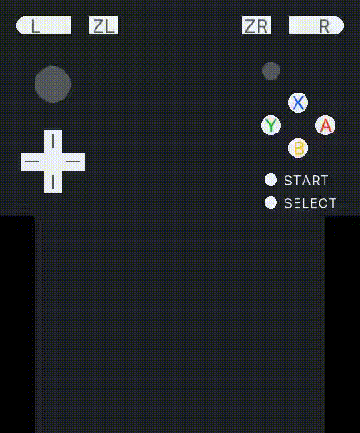

# 3Dtrident

Es una aplicación de videoconsola retro cuya función es probar el funcionamiento de la consola en sí.

Progreso actual:



# Objetivos

- [ ] [POR ACABAR] Pantalla para probar la entrada del hardware como *joysticks*, gatillos, cruceta...
- [ ] [PRÓXIMO] Pantalla para probar el táctil de la consola mediante un *paint*.
- [ ] [~] Apartado en donde *testear* el micrófono, audio y molumen.
- [ ] [~] Comprobar el funcionamiento de la función *3D* de la pantalla de la pantalla superior. 
- [ ] [~] Pantalla de acerca de la aplicación.
- [ ] [~] Página en la que verificar el correcto funcionamiento de sensores como infrarrojo, giroscópio, acelerómetro...

# Compilación y contribución

Es necesario tener las librerías de desarrollo instaladas. Consulta [este sitio](https://devkitpro.org/wiki/Getting_Started).
Si trabajas desde un sistema *UNIX-like*, configura `pacman` siguiendo las instrucción de la wiki e instala el grupo `3ds-dev` para este proyecto.

Ubícate en la carpeta raíz del proyecto y sigue los siguientes comandos:

## Autocompetado de código

Puedes usar un archivo de configuración para el autocompletado de código. Para ello, debes tener instalado `clangd`. Más información [aquí](https://github.com/clangd/clangd).

Genera el archivo de configuración ejecutando:

```sh
make .clangd
```

Si eres usuario de windows, quizás te toque revisar manualmente el archivo generado.  

## Generando el ejecutable

Genera el archivo ejecutable escribiendo:

```sh
make
```

Obtendrás en el directorio raíz al menos 2 archivos, `.3dsx` y `.elf`. Ejecuta cualquiera de los dos en la consola.

# Recursos empleados

- devkitPro [github](https://github.com/devkitPro)
- Inter [github](https://github.com/rsms/inter)

Inspirada en [3DSident](https://github.com/joel16/3DSident)
